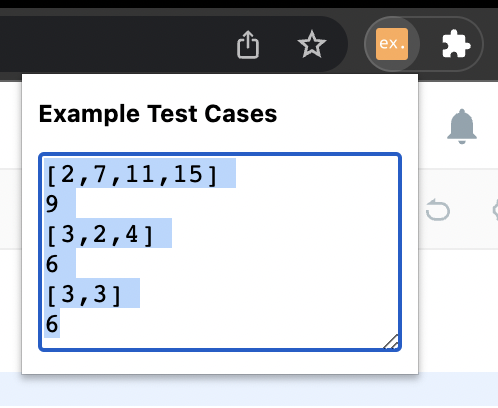

# LeetCode Examples

Simple Chrome extension that collates example testcases of LeetCode problems for you to easily copy.

## Installation

1. Clone the repository.
2. Open Chrome Extensions: `chrome://extensions`.
3. Turn on Developer Mode.
4. Press "Load Unpacked" and open the cloned folder `leetcode-examples`.
5. The extension is now active. Pin the extension for easy usage.

## Example Usage

Go to any LeetCode problem page - e.g. [https://leetcode.com/problems/two-sum/](https://leetcode.com/problems/two-sum/).  

Click the extension. All the testcases are there ready to copy, as shown below.  

Enjoy!
